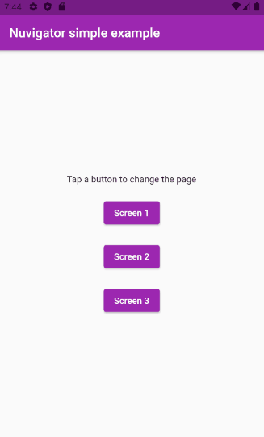

# simple_implementation

O projeto simple_implementation consiste no [exemplo mais básico](https://github.com/nubank/nuvigator#quick-start) sugerido na documentação do [Nuvigator](https://github.com/nubank/nuvigator).

## Demonstração

Demonstração de uso.

## Plugins 📟

Abaixo listamos os plugins utilizados neste projeto

- [Nuvigator](https://github.com/nubank/nuvigator)