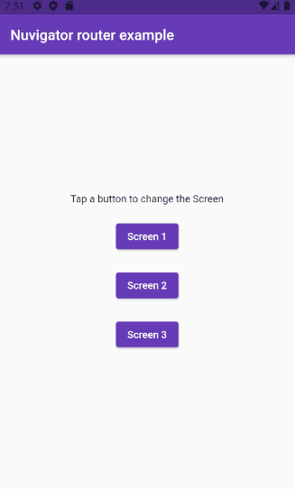

# simple_nuroute_implementation

The simple nuroute implementation It consists in the most [basic complete example](https://github.com/nubank/nuvigator#quick-start) suggested on documentation of [Nuvigator](https://github.com/nubank/nuvigator). Basically this is a personalization of the route using instances of `NuRoute` and `Nurouter`.

Não manja de inglês? Leia o [README](https://github.com/Leomhl/nuvigator_examples/blob/master/simple_nuroute_implementation/README_PT.md) em português!

## Demonstration

Demonstration of use.

## Plugins 📟

Below we list the plugins used in the projects.

- [Nuvigator](https://github.com/nubank/nuvigator)