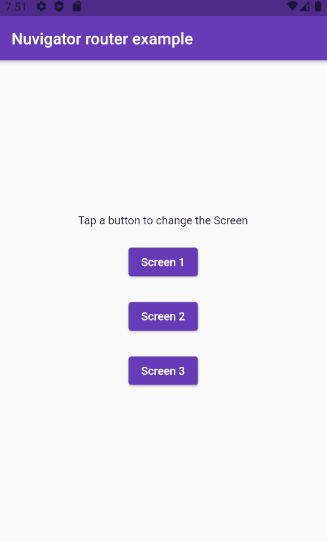

# simple_nuroute_implementation

O projeto simple_nuroute_implementation consiste no exemplo [mais básico personalizável](https://github.com/nubank/nuvigator#quick-start) sugerido na documentação do [Nuvigator](https://github.com/nubank/nuvigator). Basicamente esta é uma personalização das rotas utilizando a instanciação da classes `NuRoute` e `Nurouter`.

## Demonstração

Demonstração de uso.

## Plugins 📟

Abaixo listamos os plugins utilizados neste projeto.

- [Nuvigator](https://github.com/nubank/nuvigator)