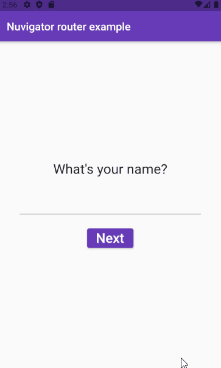

# simple_route_parameters_implementation

A implementação simples de parâmetros e rotas consiste em um exemplo que demonstra a passagem de parâmetros (valores) entre as rotas para serem exibidos nas telas de um aplicativo.

## Plugins 📟

Abaixo listamos os plugins utilizados neste projeto.

- [Nuvigator](https://github.com/nubank/nuvigator)